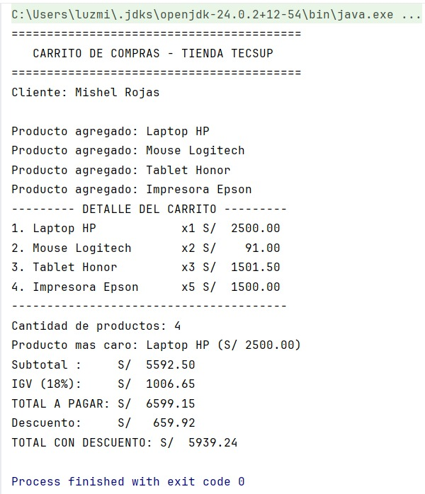

# Laboratorio 02: Carrito de compras

Alumna: Rojas Tuesta Luz Mishel

## Descripción

Programa de consola en Kotlin de un carrito de compras (Tienda TECSUP).
Muestra el cliente, los productos, el detalle alineado, subtotal, IGV (18%),
total, el producto más caro y un descuento según el monto.

Funciones que implementé:
- `calcularSubtotal`
- `calcularIGV`
- `calcularTotal`
- `mostrarDetalle`
- `calcularDescuento`

También usé una `data class Producto` y `maxByOrNull` para el producto más caro.

### Captura de pantalla

##¿Por qué nombre y precio son val pero cantidad es var?
- Porque val no se puede volver a reasignar, entonces el nombre y el precio son fijos, mientras que la cantidad es var porque un carrito de compras la cantidad de productos puede subir o bajar

##¿Qué pasaría si intentas cambiar el precio después de crear el producto?
- Nos saldría un error de compilación, ya que el programa no llega ni a ejecutarse 