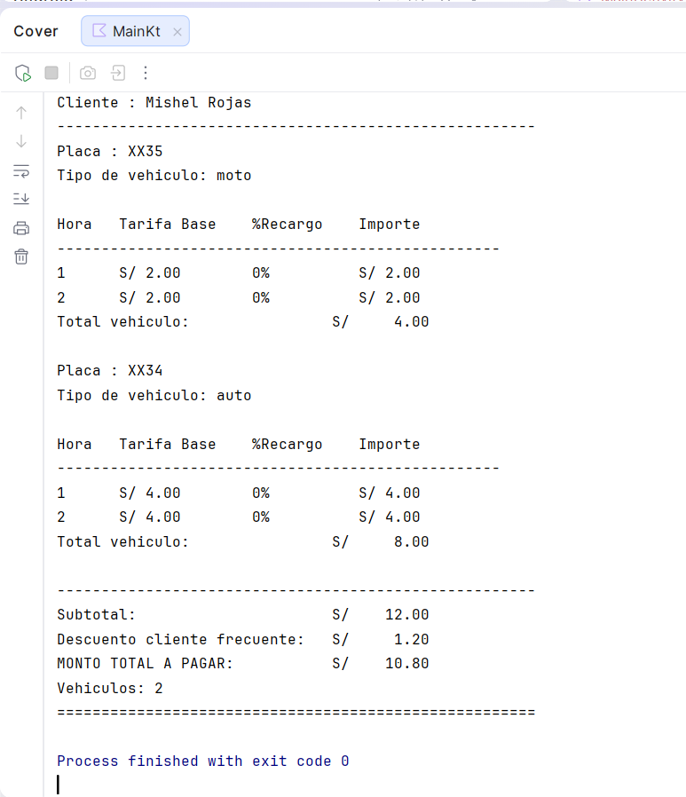

# Laboratorio 02: Playa de autos

Alumna: Rojas Tuesta Luz Mishel

Programa de consola en Kotlin (sin interfaz grafica).

## Archivos

```
app/src/main/java/com.rojastuesta.lab02playadeautos/
  ├── Vehiculo.kt
  ├── PlayaDeAutos.kt
  └── Main.kt
```

- `Vehiculo`: placa, tipo, horas, cliente frecuente y nombre. Calcula tarifa, recargo y total.
- `PlayaDeAutos`: guarda los vehiculos y arma la boleta. Si el cliente es el mismo, salen todos sus autos en una sola boleta.
- `Main.kt`: pide los datos del cliente una vez y luego solo placa y tipo de cada auto.

## Tarifas

| Tipo      | S/ por hora |
|-----------|-------------|
| Moto      | 2.00        |
| Auto      | 4.00        |
| Camioneta | 10.00       |

Recargo por hora: 1-2 = 0%, 3-5 = 20%, 6 en adelante = 50%.  
Cliente frecuente: 10% sobre el subtotal.

## Como ejecutarlo

Android Studio → File → Open → `lab02PlayaDeAutos`.  
Abrir `Main.kt` → Run 'MainKt' with Coverage.

## Resultado (terminal)


