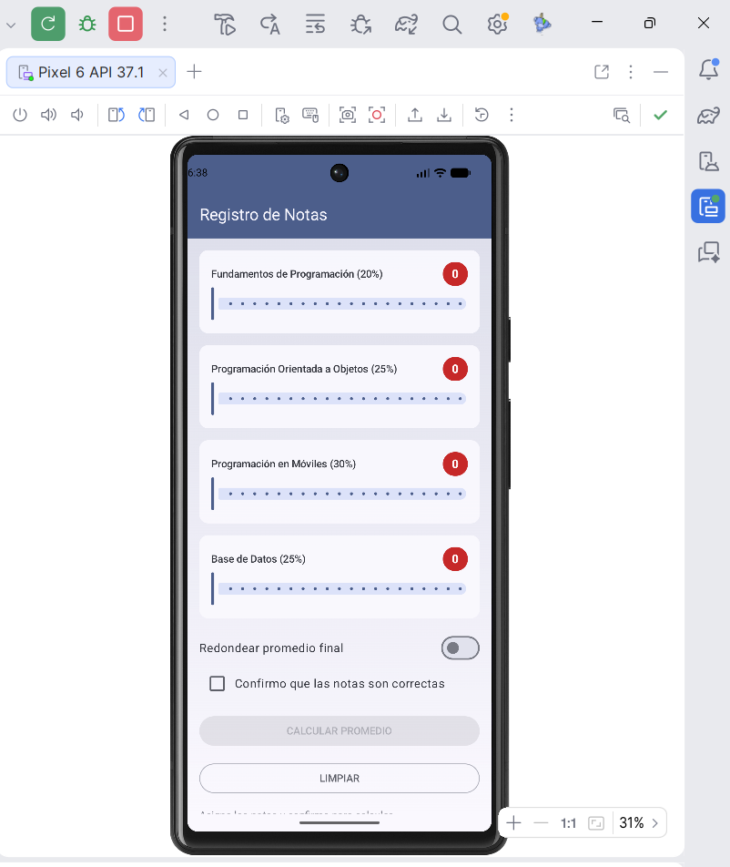
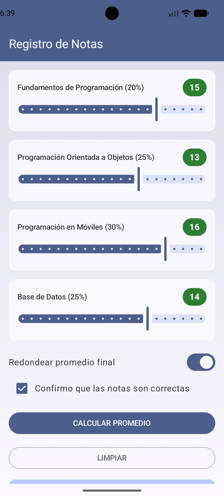
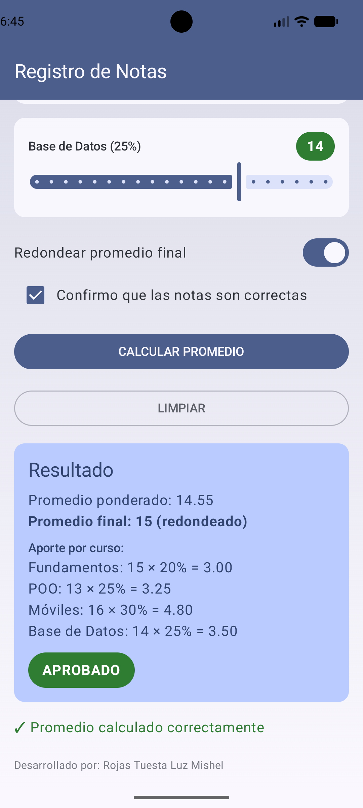

# Laboratorio 03 — Tarea: Registro de Notas

Alumna: Rojas Tuesta Luz Mishel

App en Jetpack Compose para calcular el promedio ponderado de 4 cursos.
Cada curso tiene un Slider (nota entera de 0 a 20). Un Switch redondea el
promedio final. Un Checkbox confirma las notas y recién ahí se habilita
el botón CALCULAR PROMEDIO.

## Cómo calcular

Promedio ponderado =
Fundamentos × 20% + POO × 25% + Móviles × 30% + Base de Datos × 25%

Si el Switch está ON, el promedio final se redondea con `roundToInt()`.
La observación sale con `when` según el promedio final:

| Promedio final | Observación |
| --- | --- |
| 17 o más | EXCELENTE |
| 13 a 16 | APROBADO |
| 10 a 12 | EN RECUPERACIÓN |
| menos de 10 | DESAPROBADO |

El badge de cada curso se pone rojo si la nota es menor a 13 y verde si es 13 o más.

## Capturas

Estado inicial (notas en 0, botón deshabilitado):

Notas asignadas (15, 13, 16, 14), Switch ON y casilla marcada:

Promedio calculado (14.55 ponderado, 15 redondeado, APROBADO):

## Casos de prueba

| Notas (F, POO, M, BD) | Redondear | Ponderado | Final | Observación |
| --- | --- | --- | --- | --- |
| 15, 13, 16, 14 | ON | 14.55 | 15 | APROBADO |
| 12, 10, 11, 9 | OFF | 10.45 | 10.45 | EN RECUPERACIÓN |
| 18, 17, 19, 18 | ON | 18.05 | 18 | EXCELENTE |
| 8, 9, 7, 10 | OFF | 8.45 | 8.45 | DESAPROBADO |

## Componentes usados

- `Slider` con `valueRange = 0f..20f` y `steps = 19` (solo enteros)
- `Switch` para redondear
- `Checkbox` para confirmar (sin eso el botón queda gris)
- `Button` CALCULAR PROMEDIO y `OutlinedButton` LIMPIAR
- `Card` con el resultado, el aporte por curso y el chip de observación

Esta tarea se hizo en la rama `con-ia`.
