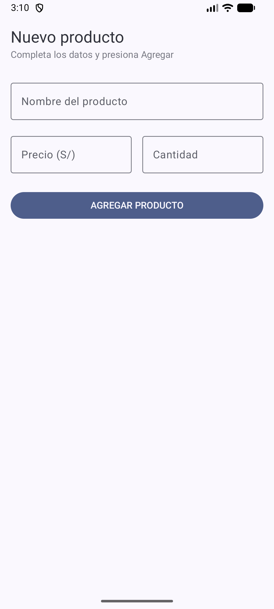
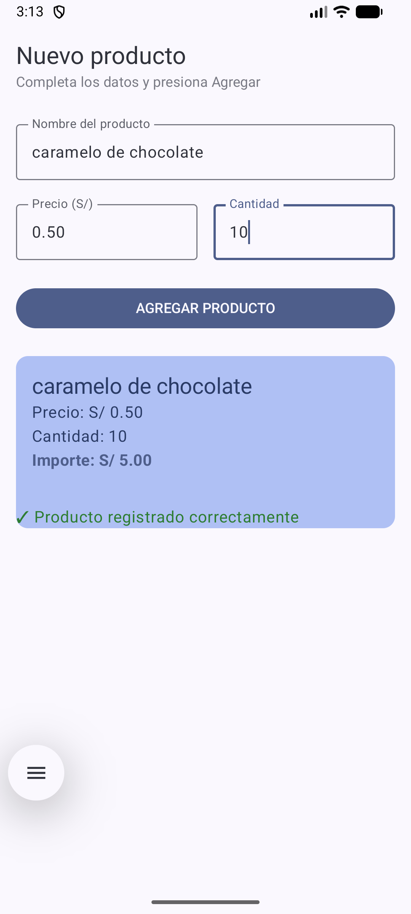

# Laboratorio 03: Registro de Producto

Alumna: Rojas Tuesta Luz Mishel

Pantalla con Jetpack Compose para registrar un producto: nombre, precio y cantidad.
Al presionar AGREGAR PRODUCTO se muestra una Card con el resumen y el importe
(precio × cantidad, con 2 decimales).

## Capturas

Pantalla inicial (formulario vacío):

Después de agregar un producto:

## ¿Qué pasaría si declaro las variables SIN remember?

Las probé sin `remember`. Al escribir una letra, Compose redibuja la pantalla
y las variables vuelven a `""`. El campo se borra solo y no se puede completar
el formulario.

`remember` guarda el estado entre un redibujo y el siguiente. Por eso el texto
que escribes se queda en el TextField.